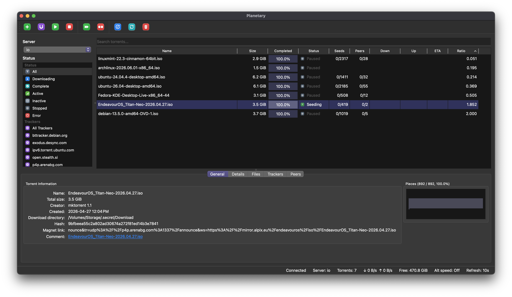
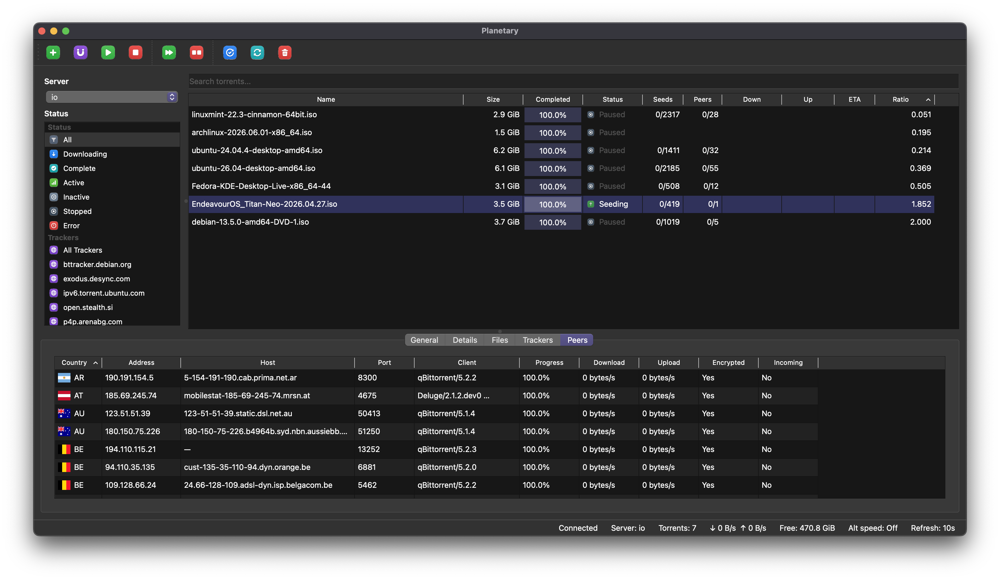

#  Planetary
(Previously "transmission-control")

[Official Web Site](https://planetary.mvgrafx.net)

This project aims to re-implement Transmission Remote GUI (https://github.com/transmission-remote-gui/transgui) - a remote GUI for the Transmission torrent daemon

The original project was written in Pascal and appears to no longer be maintained. It will soon no longer be compatible with macOS on Apple Silicon.

This implementation is in C++/Qt and will be compatible with Windows/macOS/Linux/etc.

The intention of this project is to achieve feature parity with Transmission Remote GUI at which point it will be christened with version 1.0.0

From there the future remains to be seen.

## Screenshots

## Support Planetary

If Planetary is useful to you and you'd like to support continued development:

Support is entirely optional and Planetary remains available regardless of contribution.