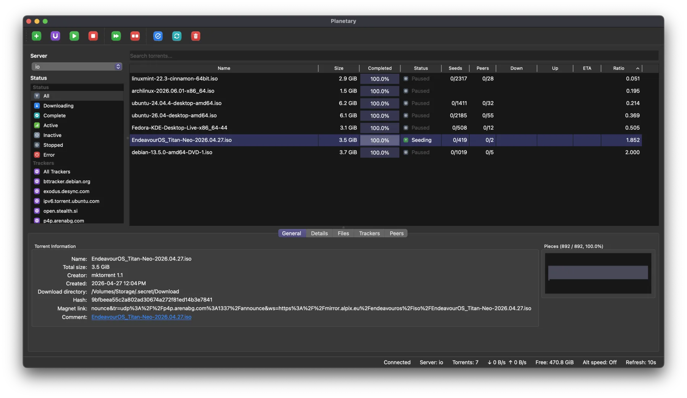
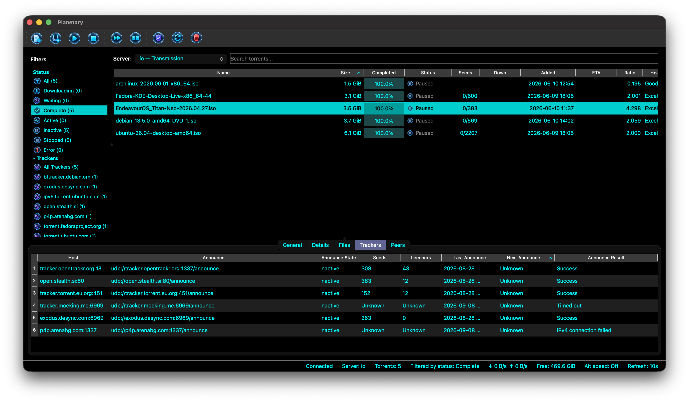
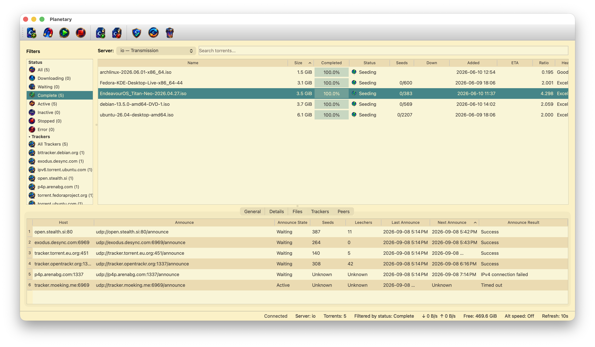

#  Planetary

Planetary is a native desktop client for remotely managing Transmission,
qBittorrent, and Deluge servers from one focused interface. It is written in
C++ with Qt and is free, open-source, and telemetry-free.

[Website](https://planetary.mvgrafx.net) ·
[Downloads](https://planetary.mvgrafx.net/downloads/) ·
[Issues](https://github.com/mveinot/transmission-control/issues)

## Features

- Manage multiple Transmission, qBittorrent, and Deluge servers and switch
  between them from the same window.
- Add transfers from local `.torrent` files, remote torrent URLs, magnet links,
  the clipboard, registered file handlers, or watched folders.
- Choose whether torrent and magnet additions show the options dialog, select
  files and priorities before adding, and rename a torrent's top-level folder.
- Inspect files, piece progress, peers, trackers, properties, session details,
  and aggregate transfer statistics.
- Start, stop, verify, reannounce, relocate, remove, and reorder torrents, with
  backend-specific controls exposed where supported.
- Filter by status, tracker, or folder; search torrents and their file trees;
  and work with labels and groups.
- See rates, free space, alternate-speed status, and connection state in the
  main window, with total, downloading, and seeding counts also available from
  the notification-area menu.
- Receive native or command-based notifications and check for releases with
  notes displayed inside the application.
- Resolve peer countries locally using the bundled DB-IP Lite database—no peer
  addresses are sent to an external lookup service.

## Themes

Planetary supports independently selectable icon and colour themes. Changes
apply immediately throughout the application without a restart, and hover
states are generated in software so external icon sets do not need duplicate
assets.

External themes can provide icons, colours, or both. They may be installed as
folders or as single-file `.planetarytheme` packages; opening a package installs
it and makes its components available under **Settings → Appearance**. Missing
icons safely fall back through the built-in theme set.

## Screenshots

<table>
  <tr>
    <td width="50%"></td>
    <td width="50%"></td>
  </tr>
  <tr>
    <td align="center">Elflord colours with Polar Night icons</td>
    <td align="center">Gruvbox Light with Celestial Enamel icons</td>
  </tr>
</table>

## Platforms

The distributed macOS build is universal for Apple Silicon and Intel and
supports macOS 13 or later. The source also builds on Windows and Linux, though
those platforms have not yet received the same packaging and refinement work.

Planetary began as a modern C++/Qt reimplementation of
[Transmission Remote GUI](https://github.com/transmission-remote-gui/transgui)
and has since grown into a multi-backend client.

## Support Planetary

If Planetary is useful to you and you'd like to support continued development:

Support is entirely optional and Planetary remains available regardless of contribution.

## Development documentation

- [Release update manifest](docs/release-manifest.md)
- [Bundled C dependencies](docs/bundled-dependencies.md)

## License

Planetary is licensed under the GNU General Public License, version 2 or (at
your option) any later version. Bundled third-party components remain under
their respective licenses; their source, provenance, and license texts are
kept in [`third_party`](third_party/).
